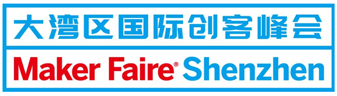
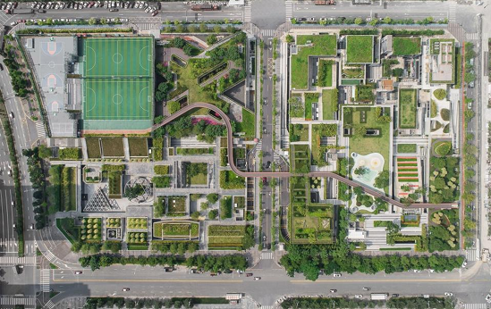
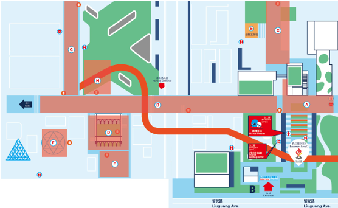

# **The Radio Game** or **广播游戏** or **Il Gioco Radio** or 
a Meshtastic  powered, Borges/Boal/Propp inspired workshop toolkit to make events participants get to know specific elements of an event

The first Radio Game is going to take place at Shenzhen Maker Faire 2025 

  

  

# Premises and intentions:

The aim of this game is to lead participants to discover elements of a place (place: a fair, an event, a place of public interest) through interaction with other users and objects, in the completion of a mission. 

The subject-hero solves a educational mission through a object-value. The most ancient story told in the steppe around the fire. [Vladimir Propp in Morphology of the Folktale](https://en.wikipedia.org/wiki/Vladimir_Propp). 

There are many cultural references for this approach in my mind: there is a bit of Borges in this gamification of the present, almost as if trying to make sense of the present through a game (“[The Lottery of Babylon](https://en.wikipedia.org/wiki/The_Lottery_in_Babylon)”), but also Augusto Boal and his [Invisible Theater](https://en.wikipedia.org/wiki/Invisible_theater). And then [Nanni Loy](https://en.wikipedia.org/wiki/Nanni_Loy) with the mirror...

Much more simply, it is a matter of building a fixed narrative infrastructure that the user must go through in order to achieve something. 
In doing so, they will discover certain things (about themselves, the space they are in, life). 

Many scholars argue that learning in this way (outside one's comfort zone) is more productive, stays better in the brain. Traumas 😂🫣.

But let's get back to the matter at hand, stop this cultural violins I know you are pragmantic people lol.

# Users

There are three types of users in this game:
1) Event **participants**, divided into **groups** of 3-4 players.
2) **Actors** within the event who will help the participants group to go in a certain direction.
3) **Organizers** who monitor everything and produce the gmae.

# How does it work?

Participants are given T1000E radios (or any Meshtastic radio?). 
Through the radios, they can communicate with each other and with the **game master** node, as well as with other users.

**Example**: Mission #1 for group #1 is to take object #1 from the “man with the yellow hat”: they will have to find him using location tracking or simply by sight. The character will give them an object which, if taken to location #1, will allow them to move on to the next step. 

## Group #1

Consisting of 3-4 participants, technically it could also have more than one radio. It also exists as “group #1” on Meshtastic. The creation of the groups is up to us organizers.

Object #1 has an NFC tag that can open the lock on a small box #2, but where is it? They will only find out if they solve mission #2.

### How many groups will we have at the same time?

With the current structure, only two. Technically, the size of the event allows for up to six. 

### How can we tell who is playing?

We could give participants a sticker or pin.

### Is there a minimum age for participants?

To be verified for use of the app, I think they must be of legal age (to be verified).

# Technology

The idea behind this game is make people aware of the possibilities mesh communication have in an event scenario. 
Me (as: the Game master, and the storyteller as of now), I think the whole game could be produced by simple human interactions (so no need of extra stuff!) but we are (going to be) in Shenzhen, and it's 2025.I know you want to automate and play with things. Pushing to the limit. 

We could have nodes that behave and talk to the mesh using [meshbot](https://github.com/vongomben/meshbot).
I'm about to release a version of meshbot using and NFC reader. Ths means we could have a node broadcasting the tags that open / trigger things.

## Ok. I'm a maker, I like this idea, I want to help. Where do I start?

Great. You come to Shenzhen in November right? how far do you want to go in the rabbit hole of the **The Radio Game**?

You could be many things:
1) an **Actor** --> I come to SHZ to do my stuff, I like the idea. tell me what to do if somebody is asking me about something. [Open an issue](https://github.com/vongomben/radio-game/issues/new) an/or tell the team you want to be part as an actor.
2) a **member of the organizing team**. I want to help the team be in the Control Room (which is probably going to be a table with some chairs :) [Open an issue](https://github.com/vongomben/radio-game/issues/new) an/or tell the team you want to be part as an organizer!
3) a **Producer of a node** --> I have Xiaos, meshtastic radios etc. I know the drill. I can make a full fledged in/out performance object that could be used in the event! [Open an issue](https://github.com/vongomben/radio-game/issues/new) an/or tell the team how you want to sew this into an organic and complex, temporary mayhem.

In the case of a Producer, these nodes are welcome:
* a node that, doing a specific gesture🤌🏼, sends a message
* a node that, on a a specific nfc reading, sends a message
* a node that, on a a specific message received, opens a servo and lets and object in the hands of the participant. 

Obvouisly, this has to meet the location's needs, and shouldn't bother or make the overall production more complex.

We'll eventually manage the operations from Chaihuo Makerspace in the limited timed windows this project will happen.  

